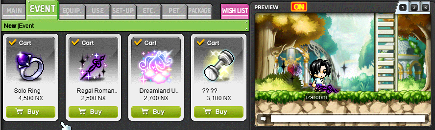
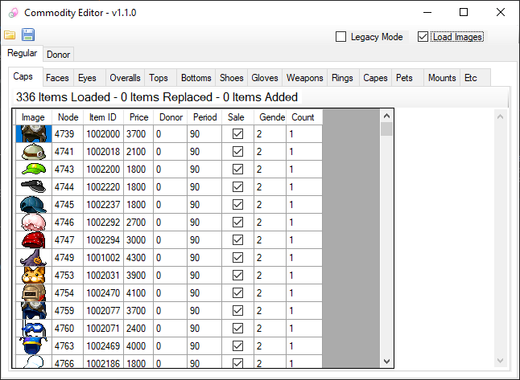

# CashCommodities
A tool for editing the in-game Cash Shop (Etc.wz)

Place the program in your MapleStory folder and click the folder icon to load your Cash Shop.

- Double click on a `Price` cell to change all other Price cells to that value
- Edit individual cell values
- Categories for each type of equipment
- Automatically generates unique SN for new items

# Features

## Legacy Mode

If your cash shop `Event` tab looks like this, enable the `Legacy Mode` checkbox to add new items to the `Event > New` tab.

This should be disabled for servers that may have already updated Cash Shops with tabs for each equipment category.

## Load Images

You can use the `Load Images` checkbox to view images of items in each category. This will increase load times due to having to parse files then decode images.

