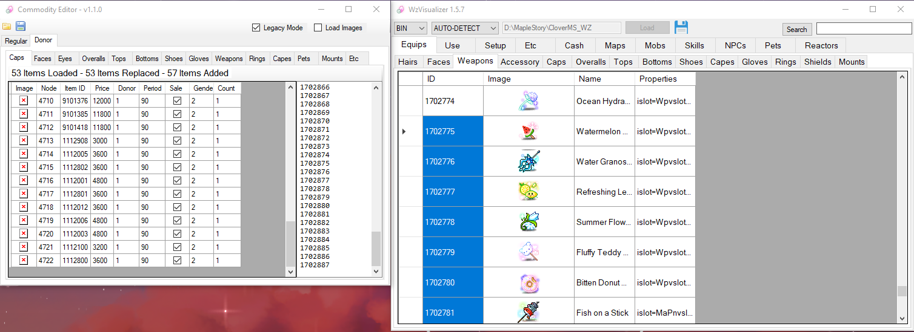
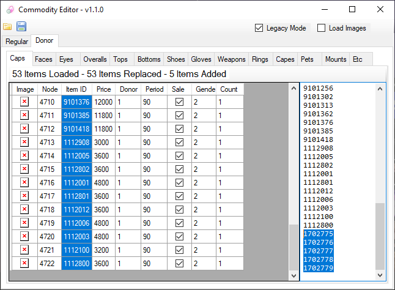
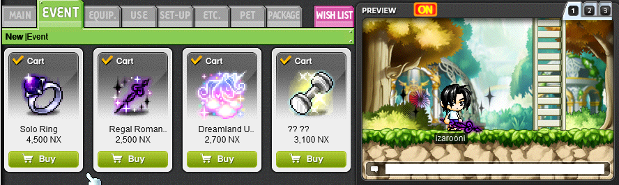
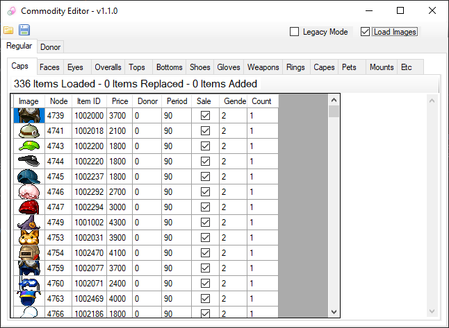

# CashCommodities
A tool for editing the in-game Cash Shop (Etc.wz)

Place the program in your MapleStory folder and click the folder icon to load your Cash Shop.

- Double click on a `Price` cell to change all other Price cells to that value
- Edit individual cell values
- Categories for each type of equipment
- Automatically generates unique SN for new items

# How To Use

Using [WzVisualizer](https://github.com/izarooni/WzVisualizer/releases/latest), or any other tool that you'd like, get a list of item IDs and paste them into the large text box on the right.

Each line should have 1 item ID, the line number is associated to a row in the table.

If there are more items IDs on the right than rows in the table, the extra item IDs are added as new items.

If you want to keep existing items and add to them, all you really have to do is:
- Copy the existing ones by selecting them
- Hit `CTRL+C` to copy all values
- Paste into the box on the right
- Add more item IDs to the bottom of that list

# Features

### **Legacy Mode**

If your cash shop `Event` tab looks like this, enable the `Legacy Mode` checkbox to add new items to the `Event > New` tab.

This should be disabled for servers that may have already updated Cash Shops with tabs for each equipment category.

### **Load Images**

You can use the `Load Images` checkbox to view images of items in each category. This will increase load times due to having to parse files then decode images.

