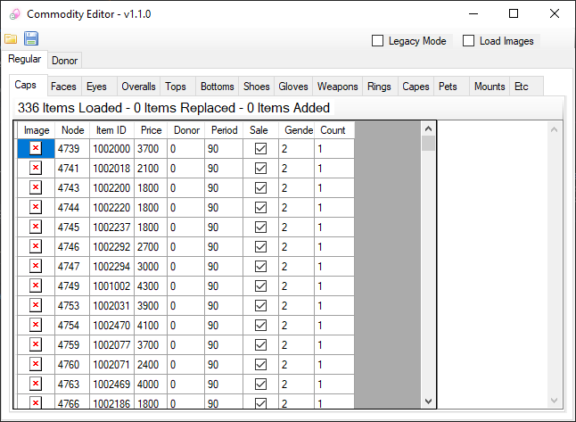

# CashCommodities
A tool for editing the in-game Cash Shop

- Double click a Price cell to change all other Price cells to that value
- Edit certain node values quickly (i.e: ItemID, Price, Donor, Period)
- Organized item categories which allows updating items in large batchse
- Automatically generates unique SN for new items

